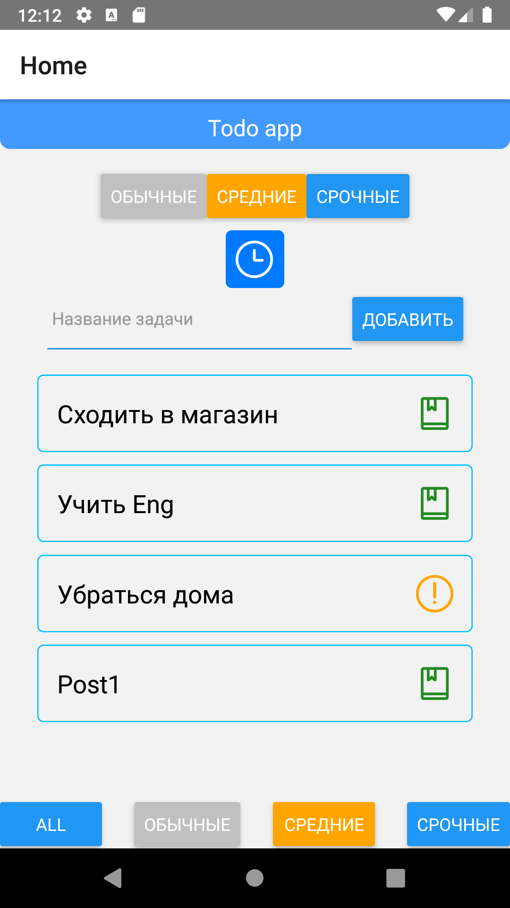

# todonative
Для запуска нужно:

git clone
npm i
ЗАПУСТИТЬ ТРИ ТЕРМИНАЛ:
в 1 терминал прписать : react-native start
в 2 терминал прписать :json-server -w db.json
в 3 терминал прписать :npm run tunnel

из 3 терминала взять ссылку на ваш адрес (первая строчка на против слова "Forwarding") и вставить в App.js  в переменную
export const baseUrl = `http://ваша_ссылка.ngrok.io`;

запустить андроид студию и включить эмулятор :)

Список дел

